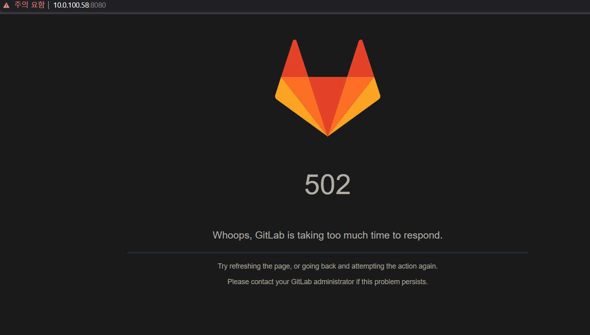
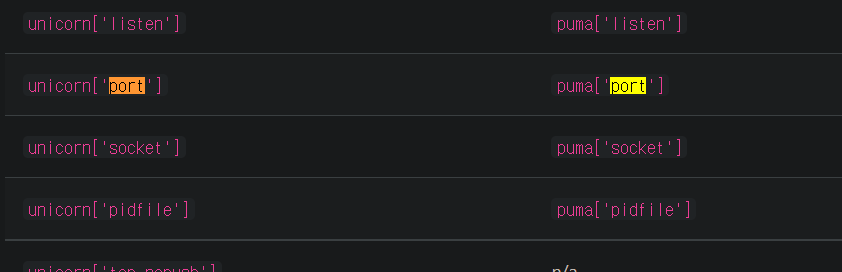

# GitLab_설치하기 (CentOS7)

### Before we go further

회사에서 Git을 사용하는데 왜 GitLab은 사용하지 않을까 고민하다 직접 건의하기엔 그렇고 ~~*(입사한지 한달)*~~ 물어볼 분들도 마땅히 없어서(~~*살짝 물어봤는데 형상관리와 voc, pms의 차이에 대해 크게 신경쓰시지 않으셔서 굳이? 또는 왜 일을 두번해? 이런 반응ㅠ*~~) 개인적으로 쓰라고 할당 받은 ip가 있는데 직접 설치해 보기로 했습니다. 아마 혼자 사용하게 될 듯 하지만... 그래도 공부 겸 해서 사용해 보려고 합니다.


  ### GitLab ?

GitLab은 Git의 원격 저장소 기능과 이슈 트래커 기능 등을 제공하는 소프트웨어로서 설치형 Github이란 컨셉으로 시작된 프로젝트 입니다. 따라서 Github와 비슷한 면이 많이 존재합니다.

서비스형 원격저장소를 운영하는 것에 대한 비용이 부담되거나, 소스코드의 보안이 중요한 프로젝트에게 적당합니다.


#### 특징

1. 설치형 버전관리 시스템
    - 자신의 서버에 직접 설치해서 사용할 수 있습니다.
2.  클라우드 버전 관리 시스템
    - gitlab.com을 이용하면 서버 없이도 Gitlab 기능을 이용할 수 있습니다.
    - 10명 이하의 프로젝트는 무료로 사용할 수 있습니다.
3.  Issue tracker 제공
4. Git 원격 저장소 제공
5. API 제공
6. Team, Group 기능 제공


### 설치

#### 버전

> OS : CentOS 7
>
> GitLab : gitlab-ce (community edition)

#### 사양
> Linux installation is quicker to install, easier to upgrade and contains features to enhance reliability not found in other methods. Install via a single package (also known as Omnibus) that bundles all the different services and tools required to run GitLab. At least 4 GB of RAM is recommended

4GB 이상의 램이 필요.

#### 1. Gitlab 설치 시 필요한 패키지 설치

``` 
sudo yum install -y curl policycoreutils-python openssh-server perl
sudo systemctl enable sshd
sudo systemctl start sshd
sudo firewall-cmd --permanent --add-service=http
sudo firewall-cmd --permanent --add-service=https
sudo systemctl reload firewalld
```

저는 기본적으로 ```openssh-server```가 설치되어 있더군요. ```sshd``` 를 실행시켜 주시고 ```firewall```에 ```http```와 ```https```를 등록시킨 후 재시작 하시면 됩니다.

#### 2. 필요한 패키지 설치 확인

##### 1. policycoreutils-python

``` 
yum list installed | grep policycoreutils-python
```

##### 2. openssh-server

```
yum list installed | grep openssh-server
```

##### 3. openssh-server 구동 여부 확인

```
 systemctl status sshd
```

```
[root@localhost /]# systemctl status sshd
● sshd.service - OpenSSH server daemon
   Loaded: loaded (/usr/lib/systemd/system/sshd.service; enabled; vendor preset: enabled)
   Active: active (running) since 수 2021-09-08 15:45:25 KST; 20min ago
     Docs: man:sshd(8)
           man:sshd_config(5)
 Main PID: 1145 (sshd)
    Tasks: 1
   CGroup: /system.slice/sshd.service
           └─1145 /usr/sbin/sshd -D

 9월 08 15:45:24 localhost.localdomain systemd[1]: Starting OpenSSH server daemon...
 9월 08 15:45:24 localhost.localdomain sshd[1145]: Server listening on 0.0.0.0 port 22.
 9월 08 15:45:24 localhost.localdomain sshd[1145]: Server listening on :: port 22.
 9월 08 15:45:25 localhost.localdomain systemd[1]: Started OpenSSH server daemon.
 9월 08 15:48:26 localhost.localdomain sshd[10068]: Connection closed by 10.0.120.8 port 55524 [preauth]
 9월 08 15:50:06 localhost.localdomain sshd[10096]: Accepted password for eisen from 10.0.120.8 port 55536 ssh2
```

##### 4. 메일링 서비스

````
sudo yum install postfix
sudo systemctl enable postfix
sudo systemctl start postfix
````

저는 기본적으로 메일링 서비스는 세팅이 되어 있더군요. CentOS 기본 설치 설정에 따라 다른듯 합니다.


#### 3. GitLab 설치하기

##### 1. Gitlab-ce Packgage repository 추가

```
 curl https://packages.gitlab.com/install/repositories/gitlab/gitlab-ee/script.rpm.sh | sudo bash
```

끝에 | sudo bash까지 적으셔야 실행이 되더군요. 적지 않으면 script가 그대로 출력됩니다.

##### 2. Gitlab을 접속하기 위한 url 설정 후 gitlab-ce 설치

```
   sudo EXTERNAL_URL="자신의 도메인이나 접속가능한 IP:접속할 Port번호" yum install -y gitlab-ee
   ex) sudo EXTERNAL_URL="http://10.0.100.58:8080" yum install -y gitlab-ee
```

##### 3. 설치 완료 후 EXTERNAL_URL 에 설정된 주소로 접속 후 Gitlab 페이지 확인


#### 오류 발생 시 

##### 방화벽 해제

``` iptables``` 를 이용하여 방화벽 해제

```
iptables -F
```


##### 502 발생 시




#### Error executing action `restart` on resource 'sidekiq_service[sidekiq]' 발생  시

- ``` gitlab-ctl reconfigure``` 실행 시 발생.

```
    ================================================================================
    Error executing action `restart` on resource 'sidekiq_service[sidekiq]'
    ================================================================================

    Mixlib::ShellOut::ShellCommandFailed
    ------------------------------------
    runit_service[sidekiq] (/opt/gitlab/embedded/cookbooks/cache/cookbooks/gitlab/resources/sidekiq_service.rb line 50) had an error: Mixlib::ShellOut::ShellCommandFailed: Expected process to exit with [0], but received '1'
    ---- Begin output of /opt/gitlab/embedded/bin/sv restart /opt/gitlab/service/sidekiq ----
    STDOUT: timeout: run: /opt/gitlab/service/sidekiq: (pid 8920) 361s, got TERM
    STDERR:
    ---- End output of /opt/gitlab/embedded/bin/sv restart /opt/gitlab/service/sidekiq ----
    Ran /opt/gitlab/embedded/bin/sv restart /opt/gitlab/service/sidekiq returned 1

    Cookbook Trace:
    ---------------
    /opt/gitlab/embedded/cookbooks/cache/cookbooks/runit/libraries/helpers.rb:136:in `tap'
    /opt/gitlab/embedded/cookbooks/cache/cookbooks/runit/libraries/helpers.rb:136:in `safe_sv_shellout!'
    /opt/gitlab/embedded/cookbooks/cache/cookbooks/runit/libraries/helpers.rb:164:in `restart_service'
    /opt/gitlab/embedded/cookbooks/cache/cookbooks/runit/libraries/provider_runit_service.rb:357:in `block in <class:RunitService>'

    Resource Declaration:
    ---------------------
    # In /opt/gitlab/embedded/cookbooks/cache/cookbooks/gitlab/recipes/sidekiq.rb

     21: sidekiq_service 'sidekiq' do
     22:   rails_app 'gitlab-rails'
     23:   user account_helper.gitlab_user
     24:   group account_helper.gitlab_group
     25: end
     26:

    Compiled Resource:
    ------------------
    # Declared in /opt/gitlab/embedded/cookbooks/cache/cookbooks/gitlab/recipes/sidekiq.rb:21:in `from_file'

    sidekiq_service("sidekiq") do
      action [:enable]
      default_guard_interpreter :default
      declared_type :sidekiq_service
      cookbook_name "gitlab"
      recipe_name "sidekiq"
      rails_app "gitlab-rails"
      user "git"
      group "git"
    end

    System Info:
    ------------
    chef_version=15.14.0
    platform=centos
    platform_version=7.9.2009
    ruby=ruby 2.7.2p137 (2020-10-01 revision 5445e04352) [x86_64-linux]
    program_name=/opt/gitlab/embedded/bin/chef-client
    executable=/opt/gitlab/embedded/bin/chef-client

Recipe: gitlab::gitlab-rails
  * execute[clear the gitlab-rails cache] action run
    - execute /opt/gitlab/bin/gitlab-rake cache:clear
Recipe: nginx::enable
  * runit_service[nginx] action restart (up to date)
Recipe: monitoring::grafana
  * runit_service[grafana] action restart (up to date)

Running handlers:
There was an error running gitlab-ctl reconfigure:

sidekiq_service[sidekiq] (gitlab::sidekiq line 21) had an error: Mixlib::ShellOut::ShellCommandFailed: runit_service[sidekiq] (/opt/gitlab/embedded/cookbooks/cache/cookbooks/gitlab/resources/sidekiq_service.rb line 50) had an error: Mixlib::ShellOut::ShellCommandFailed: Expected process to exit with [0], but received '1'
---- Begin output of /opt/gitlab/embedded/bin/sv restart /opt/gitlab/service/sidekiq ----
STDOUT: timeout: run: /opt/gitlab/service/sidekiq: (pid 8920) 361s, got TERM
STDERR:
---- End output of /opt/gitlab/embedded/bin/sv restart /opt/gitlab/service/sidekiq ----
Ran /opt/gitlab/embedded/bin/sv restart /opt/gitlab/service/sidekiq returned 1
```

아래 명령어 입력

```
sudo gitlab-rake cache:clear 
```


#### 1. gitlab 멈추기

``` 
gitlab-ctl stop
```

#### 2. 설청파일 열기

```
vim /etc/gitlab/gitlab.rb
```

#### 3. 포트 변경

```
unicorn['port']=8081
```

로 수정 시

```
Removals:
* unicorn['port'] has been deprecated since 13.10 and was removed in 14.0. Starting with GitLab 14.0, Unicorn is no longer supported and users must switch to Puma, following https://docs.gitlab.com/ee/administration/operations/puma.html.

Running handlers complete
Chef Infra Client failed. 0 resources updated in 06 second
```

아래처럼 ```puma['port']``` 를 사용하게끔 변경




### References

https://jhhwang4195.tistory.com/50

- 영상(생활코딩)

    https://opentutorials.org/course/785/4933

- 설치

    https://simplehanlab.github.io/linux/gitlab-install-1/

- 오류

    - 502

    https://porinn.tistory.com/24

    https://stackoverflow.com/questions/33254100/502-whoops-gitlab-is-taking-too-much-time-to-respond
    
    https://about.gitlab.com/install/#centos-7