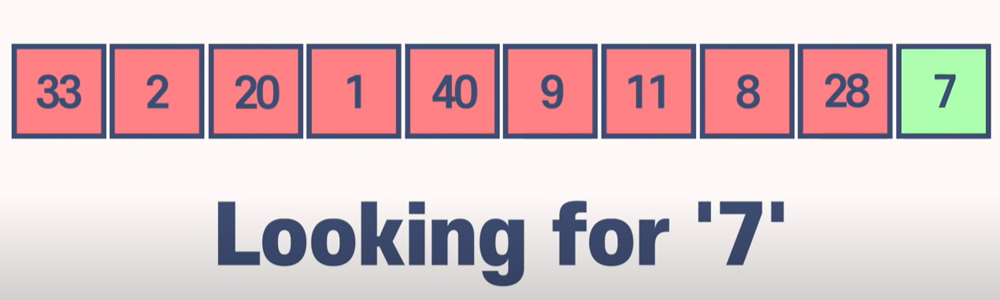
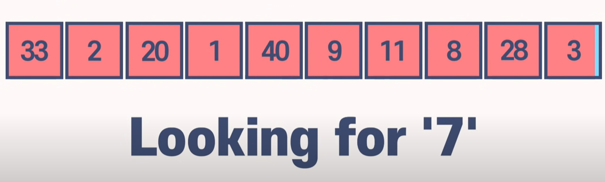
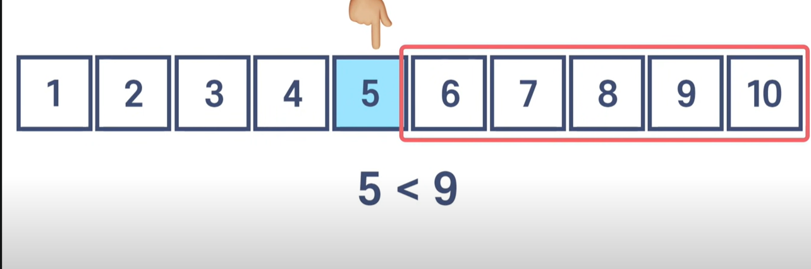
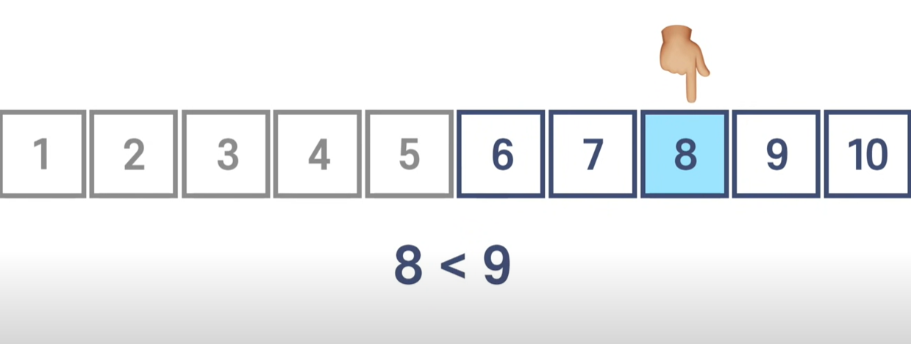
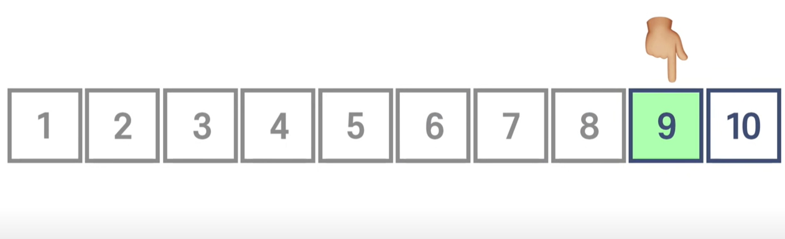
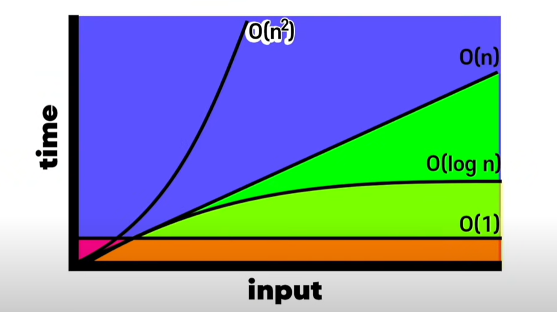

## Binary Search 와  Linear Search

### Algorithm ?

List of steps 

​	- 어떤 작업을 수행하기 위해서 하는 절차/단계

​	- i.g) 음식 레시피.

time complexty(시간 복잡도) 

​	- 얼마나 많은 절차/단계가 필요한가(how many steps)

### 종류

Sorting Algorithm (정리)

Searching Algorithm (검색)

## Linear Search Algorithm

자연스럽게 앞에서 부터 검색.

#### 단점

1. 검색의 결과가 가장 끝에 존재

    

2. 검색의 결과가 존재하지 않을 시.

    

#### Result

배열이 커지면 커질수록 검색을 하는 시간이 늘어납니다.

## Binary Search Algorithm

어떤 알고리즘은 특정 자료구조에서만 사용 가능.

이진검색(Binary Search) 알고리즘이 해당됨.

오직 정렬된 배열(Sorted Array)에서만 사용 가능.

정렬이 된 배열에 아이템을 추가하는것은 정렬이 되지 않은 배열보다 시간이 더욱 많이 걸림

두개로 쪼개는 것을 의미

0, 1을 의미하지 않음.

정 가운데서 시작. 정 가운데 숫자와 찾으려는 숫자를 비교.  

9를 찾으려는데 3번의 스텝이 걸림. OlogN

진행할때마다 반틈을 없애고 재검색함.

검색을 많이 한다면

배열을 정렬해야함.

배열을 정렬하면 아이템을 추가할 때 시간이 걸린다.

https://www.youtube.com/watch?v=WjIlVlmmNqs&list=PL7jH19IHhOLMdHvl3KBfFI70r9P0lkJwL&index=3

