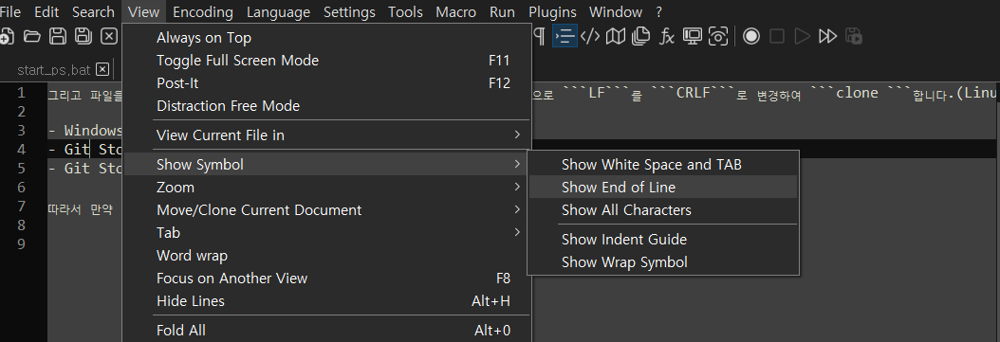
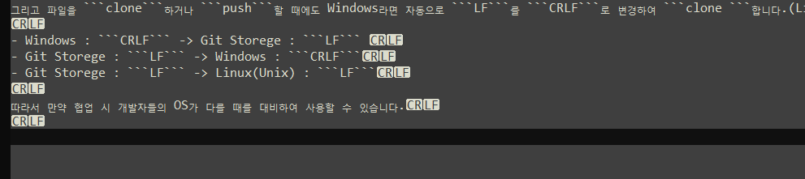
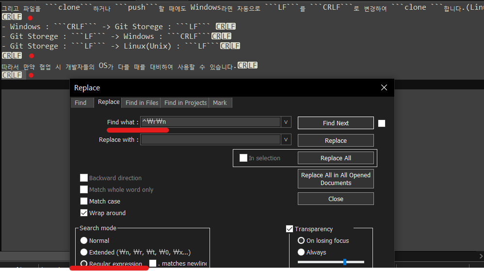
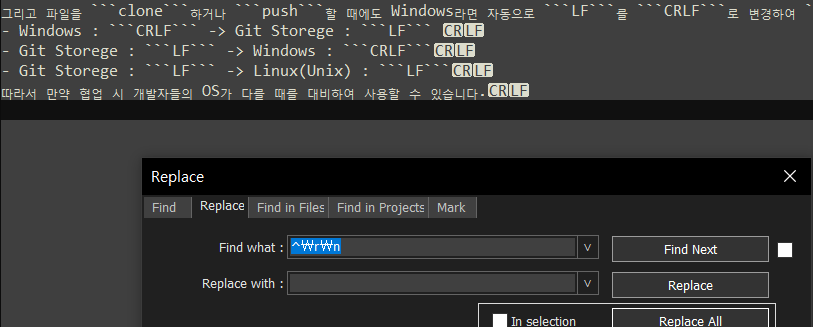

# CRLF의 기능

### Before

CRLF를 알기에 앞서 ASCII code에 대해서 기본적인 지식을 조금 알고 넘어가는 것이 좋을 듯 합니다.

new line 입력 시 사용되는 asciII code.

### ASCII code

ASCII 코드의 경우 2의 7승인 128문자로 이루어져 있으며(8비트이나 맨앞의 1비트를 제외한 7비트를 사용합니다.) Printable Characters, Control Characters로 이루어져 있습니다.


#### Control Characters

0~31과 가장 마지막 127을 포함한 총 32개를 뜻합니다. 시스템을 제어하는 용도로 사용합니다.

EndOfText, Delete, CarriageReturn, LineFeed 등

** 참고 **

​	java 혹은 javascript에서 keyEvent(down -> press -> up)를 사용하면 엔터 시 13이란 keyCode를 얻을 수 있는데 이게 바로 ASCII의 CR을 나타내는 번호 입니다.

​	그래서 13이 입력될 시 우리는 사용자가 enter를 쳤구나! 라고 알 수 있습니다.


#### Printable Characters

총 128개에서 32개를 뺀 96개의 실제 출력 할 수 있는 문자들을 뜻합니다.

WhiteSpace, 특수문자, 숫자, 대문자, 소문자 등

** 참고 **

​	만약 ASCII를 기준으로 정렬하게 된다면 숫자 > 특수문자(특정 제외) > 대문자 > 소문자 순으로 정렬됩니다.


### CRLF 기본적인 원리

아주 예전 어떤 editor에서 줄바꿈을 사용할 때 아래와 같이 사용하기 시작해서 현재까지 사용되고 있다고 합니다.

####  **Carriage Return** (\r)

```
<여기 위치로 옮기는것>-------<여기있는 글을>
```


#### Line Feed (\n)

```
-------<여기있는 글을>
-------<여기 위치로 옮기는것>
```


따라서 글을 맨 앞으로 옮긴 후 줄을 바꿔야지 우리가 익히 알고 있는 엔터의 역할을 하게 되는 것입니다.


### Git의 설정

```
git config --global core.autocrlf true
```

git에서 위와 같이 global 설정하는 이유는 Windows와 Linux(Unix), Machintosh 등이 enter를 표시할 때 서로 다르게 표시하기 때문입니다.

Windows의 경우 CRLF를 지원하고 있으며, Linux, Unix의 경우 LF만을 사용하고 있습니다.

- Windows : ```CRLF```

- Linux(Unix) : ```LF```

- Machintosh : ```CR```

따라서 ```git config --global core.autocrlf true``` 설정을 해줌으로 Windows에서 Git 저장소로 파일을 ```push``` 할 때 ```CRLF```를 ```LF```로 변경하여 저장시킵니다.

그리고 파일을 ```clone```하거나 ```push```할 때에도 Windows라면 자동으로 ```LF```를 ```CRLF```로 변경하여 ```clone ```합니다.(Linux(Unix)의 경우 변경되지 않아요.)

- Windows : ```CRLF``` -> Git Storege : ```LF``` 
- Git Storege : ```LF``` -> Windows : ```CRLF```
- Git Storege : ```LF``` -> Linux(Unix) : ```LF```

따라서 만약 협업 시 개발자들의 OS가 다를 때를 대비하여 사용할 수 있습니다.


### Tip

다양한 Editor에서 유용한 기능을 사용할 수 있습니다. 

NotePade++의 경우 View -> Show Symbol -> Show End of Line 기능을 체크하시게 되면 



이렇게 ```enter``` 가 어떤식으로 끝나는지 알 수 있습니다.(저는 현재 Windows를 사용하고 있습니다.) 



그리고 만약 ```enter```의 형태가 달라 줄바꿈이 깨져 줄바꿈이 2번씩 먹힐 경우

Replace와 Regular Expression(정규표현식)을 사용하여 ```Blank Line``` 들을 모두 지울 수 있습니다.





** 참고 **

​	Regex(Regular Expression) ```^\r\n``` : ```^``` 첫 문자가 ```\r\n```으로 시작하는 것을 찾겠다는 뜻입니다.

​	```\r\n``` : ```CRLF``` 를 Regular Expression으로 표현하는 방법입니다.


### Notice

- 매킨토시(Macintosh)의 경우 CR을 사용했었습니다.(MacOs X 이전 버전)

- macOS X로 넘어가면서 unix 기반으로 바뀌었습니다.(LF)

- HTTP에서는 CRLF를 표준으로 사용하고 있습니다.