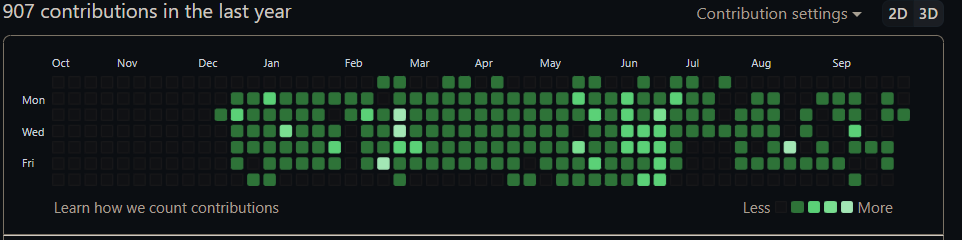
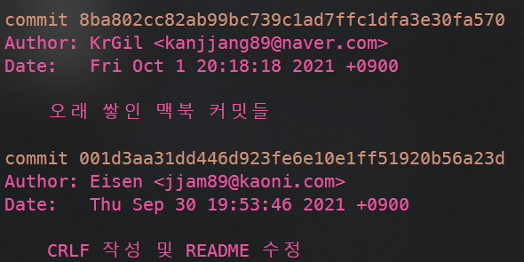
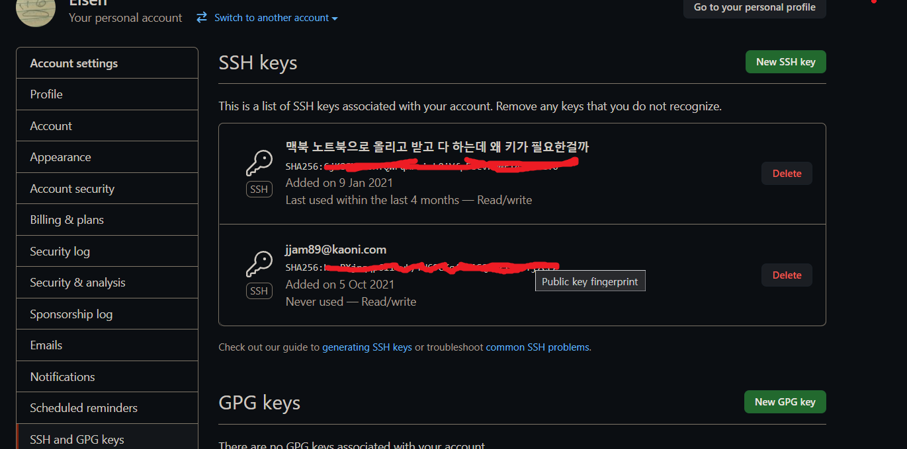

# Git 다른 email 등록하기

### Before

오늘 git contribution을 확인해 보니 이제껏 commit한 내역이 보여지지 않았습니다.

이유를 알고 보니 원래는 개인이 사용하는 email계정으로 항상 commit을 했었는데 몇달동안은 회사에서 사용하는 이메일 계정으로 commit이 이루어져 있어서 그런 듯 하더군요. ssh에 등록이 따로 되어있지 않아서 외부계정으로 인식한 듯 합니다.

이를 해결하는 방법에 대해 간략하게 설명하도록 하겠습니다.




### 내 email 확인하기

``` git log``` 명령어를 사용하여 Author의 email을 확인해봅니다.

저처럼 두개인 경우 각 email들을 github에 등록하고 이 email로 commit한 내역이 본인이 맞다는 것을 github에 알려 주어야 합니다.




### Github에 email 등록되어 있는지 확인하기

settings -> Emails 에 들어가셔서 본인이 등록되어 있는 email 주소를 확인합니다. 

만약 없다면 ```Add``` 버튼을 눌러 등록하신 후 이메일 인증을 하시면 됩니


### SSH 등록하기

settings -> SSH and GPG keys르 들어가 본인의 ssh(email)이 등록되어 있는지 확인합니다.



등록되어있지 않다면 


```ssh-keygen -t rsa -C "jjam89@kaoni.com"```

