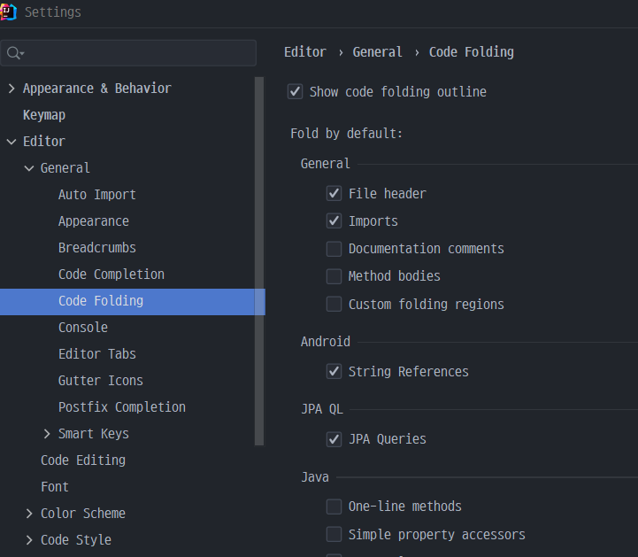

# intellj 재시작 시 한줄 재정렬 설정 변경

### Note

인텔리j 재시작 시 메서드 내의 긴 코드들이 ```...``` 으로  혹은 한줄로 재정렬 되었습니다. 

한줄로 보기 힘드신 분들을 위해 설정 방법을 알아보았습니다.


### Solution

단지 해당 메서드만 한줄을 풀고 싶으시다면

마우스 우클릭 -> folding 탭에서 원하시는 모습으로 변경하시면 됩니다.


global 설정을 주고 싶으신 분들은 File -> setting -> Editor -> General -> Code Folding -> One-line methods 를 언체크 하시면 됩니다.

****

저는 자바의 One-line methods 를 언체크 하였습니다.


다들 좋은 하루 되시길 바랍니다.