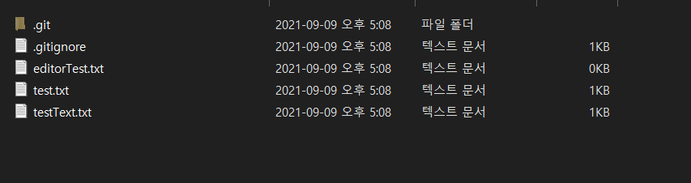
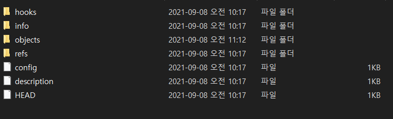
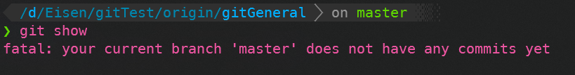
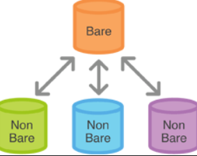

# git init 과 git init --bare

### bare

bare의 단어 뜻은 '벌거벗은', '나체의', '가리지 않은' 뜻입니다.

```git init --bare```를 직역하자면 나체의 ```git init``` 으로 뜻만 봐도 무엇인가 부족하다는 것을 알 수 있습니다.

  

### 차이

```git init```은 git repository를 생성함과 동시에 작업 공간을 함께 생성합니다.

```git init --bare```는 git repository만 만듭니다.

위에서 언급했듯 ```git init --bare```가 부족한 것은 바로 작업 공간 입니다.


``` git init```으로 만든 repository를 *non-bare git repository*라고 부르고

``` git init --bare``` 로 만든 repository를 *bare git repository*라고 부릅니다.

### non-bare git repository

우리가 ```git clone```을 하거나 ```git init```을 하게 되면 기본적으로 생성되는 repository 입니다.

clone 받은 모든 폴더와 파일들을 볼 수 있고 해당 repo(repository)에서 파일들을 수정, 삭제, 생성 등을 할 수 있습니다.

아래와 같이 생성한 directory에 히스토리와 같은 모든 git 정보들이 들어있는 ```.git``` 파일이 존재 합니다.




### bare git repository

작업 영역 없이 *__저장소__* 만을 생성합니다. 작업 영역이 없기 때문에 안에서 파일을 추가, 수정, 삭제 등을 할 수 없습니다.




### 사용 방법

git init --bare -> clone -> 작업 -> git add -> git commit -> git push


git init -> 작업 -> git init --bare -> git remote add origin 


git remote add를 하지 않고 

````
Enumerating objects: 3, done.
Counting objects: 100% (3/3), done.
Writing objects: 100% (3/3), 203 bytes | 203.00 KiB/s, done.
Total 3 (delta 0), reused 0 (delta 0), pack-reused 0
remote: error: refusing to update checked out branch: refs/heads/master
remote: error: By default, updating the current branch in a non-bare repository
remote: is denied, because it will make the index and work tree inconsistent
remote: with what you pushed, and will require 'git reset --hard' to match
remote: the work tree to HEAD.
remote:
remote: You can set the 'receive.denyCurrentBranch' configuration variable
remote: to 'ignore' or 'warn' in the remote repository to allow pushing into
remote: its current branch; however, this is not recommended unless you
remote: arranged to update its work tree to match what you pushed in some
remote: other way.
remote:
remote: To squelch this message and still keep the default behaviour, set
remote: 'receive.denyCurrentBranch' configuration variable to 'refuse'.
To D:/Eisen/gitTest/origin/gitGeneral
 ! [remote rejected] master -> master (branch is currently checked out)
error: failed to push some refs to 'D:/Eisen/gitTest/origin/gitGeneral'
````




```
On branch master
Your branch is based on 'origin/master', but the upstream is gone.
  (use "git branch --unset-upstream" to fixup)

nothing to commit, working tree clean
```


아래 적혀있는 stackoverflow를 읽고 작성합니다. 

https://stackoverflow.com/questions/7861184/what-is-the-difference-between-git-init-and-git-init-bare



# Non-Bare Git Repo

This variant creates a repository with a working directory so you can actually work (`git clone`). After creating it you will see that the directory contains a .git folder where the history and all the git plumbing goes. You work at the level where the .git folder is.

# Bare Git Repo

The other variant creates a repository without a working directory (`git clone --bare`). You don't get a directory where you can work. Everything in the directory is now what was contained in the .git folder in the above case.


When I read this question some time ago, everything was confusing to me. I just started to use git and there are these working copies (which meant nothing at that time). I will try to explain this from perspective of the guy, who just started git with no idea about terminology.

*A nice example of the differences can be described in the following way*:

`--bare` gives you just a storage place (you can not develop there). Without `--bare` it gives you ability to develop there (and have a storage place).

`git init` creates a git repository from your current directory. It adds .git folder inside of it and makes it possible to start your revision history.

`git init --bare` also creates a repository, but it does not have the working directory. This means that you can not edit files, commit your changes, add new files in that repository.

**When `--bare` can be helpful?** You and few other guys are working on the project and use git . You hosted the project on some server (`amazon ec2`). Each of you have your own machine and you push your code on `ec2`. None of you actually develop anything on `ec2` (you use your machines) - you just push your code. So your `ec2` is just a storage for all your code and should be created as `--bare` and all your machines without `--bare` (most probably just one, and other will just clone everything). The workflow looks like this: