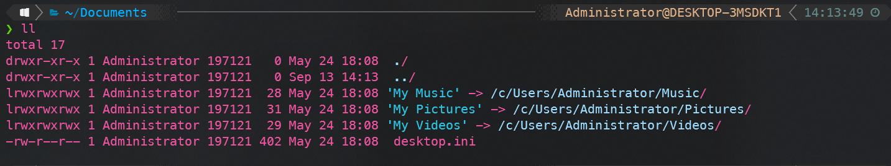
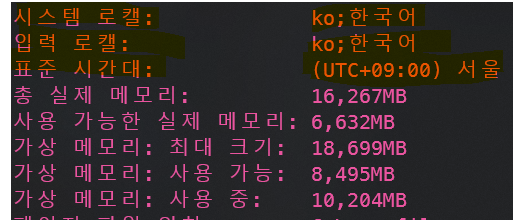

# Git-bash ls 사용 시 한글 깨짐

### before we go further

몇일 전부터 Windows 10에 ssh 서버를 설치한 후 원격으로 접속하여 사용하고 있습니다. 그런데 신기하게도 host의 컴퓨터에서 사용했을 시에는 한글이 깨지지 않는데 client에서 접속 후 ```ls``` 사용 시 한글이 깨지길래 검색 후 해결방법을 찾아 작성해 봅니다. 

*추후에 Windows 10에  ssh server를 설치하여 사용하는 방법도 정리해서 올리도록 하겠습니다.*


### git-bash의 ls 사용 시 한글 깨짐



#### Server의 system의 정보를 알아봅니다

``` systeminfo ```를 사용하여 server의 시스템 정보를 알아봅니다. locale 등 설정이 한국어로 잘 되어 있는지 확인합니다. 안되어 있다면 아래 링크를 보시고 설정을 따라해 주시면 됩니다.

https://bangu4.tistory.com/124 



#### profile 내용을 변경해 줍니다. 

간단하게 ```/etc/profile``` 파일을 ```vim``` 으로  아래 문구를 추가해 주기만 하면 됩니다.

```
alias ls='ls --show-control-chars'
```

ls를 할때마다 char를 설정해 주겠다는 의미 같은데... 정확한 원리는 검색해도 나오지 않더군요.

개인적인 생각으로는 character들을 설정에 맞게(utf-8) encoding 및 decoding을 해서 출력해 주는 듯 합니다. 


https://jhleed.tistory.com/47