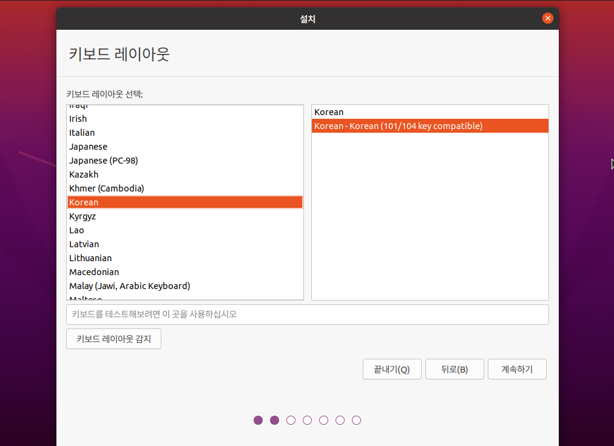
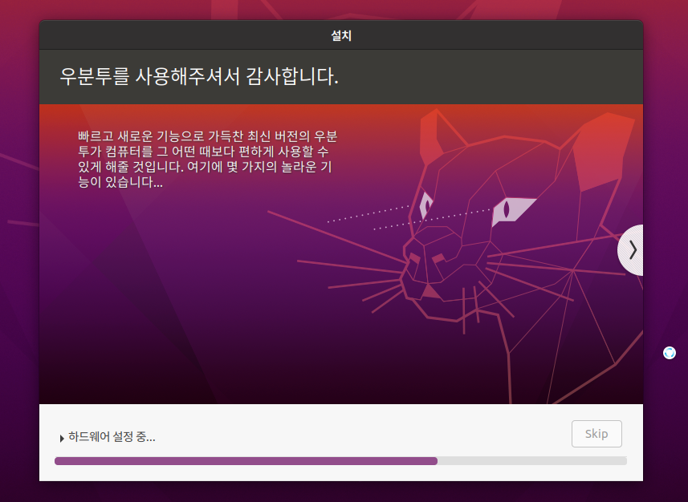

# Hiper-v에 Ubuntu 20.04 설치하기

### ubuntu-20.04.iso 파일 다운로드

아래 링크에서 받으시면 됩니다.

https://ubuntu.com/download/server

>  언어 설정

Ubuntu 설치를 클릭하시면 됩니다.

> 키보드 레이아웃 설정

본인의 키보드에 맞게 설정하시면 됩니다. 

설치 후 한영키가 먹히지 않는다면  아래 링크를 참고해 주세요.

https://shanepark.tistory.com/231

> 업데이트 및 기타 소프트웨어 설정

> 설치 유형 선택

지금 설치 클릭 후 계속하기를 클릭하시면 됩니다.

> User 정보 설정

> 설치

> 설치 완료 후 바탕화면

> Error

- network 연결 오류가 발생할 시 아래와 같이 수정.

### References

https://superuser.com/questions/1096918/ubuntu-16-04-vm-on-windows-10-hyper-v-no-network-connectivity

https://shanepark.tistory.com/