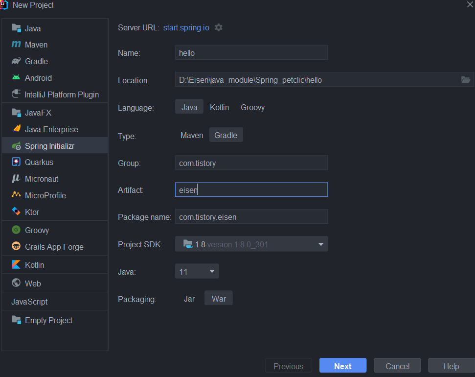
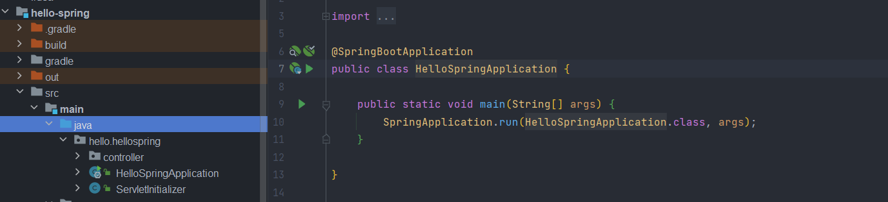
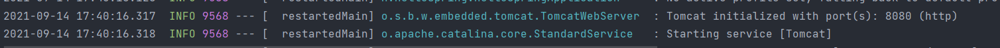
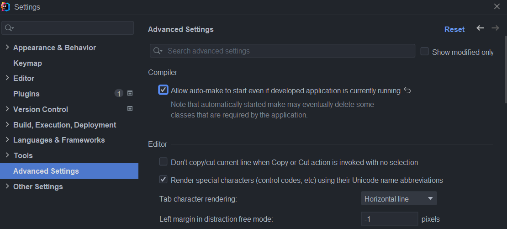
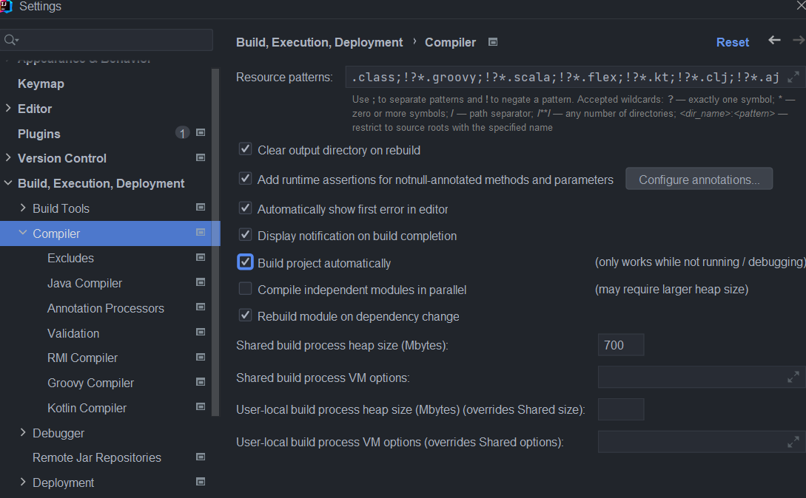
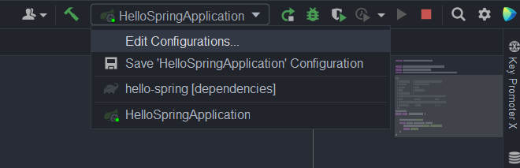
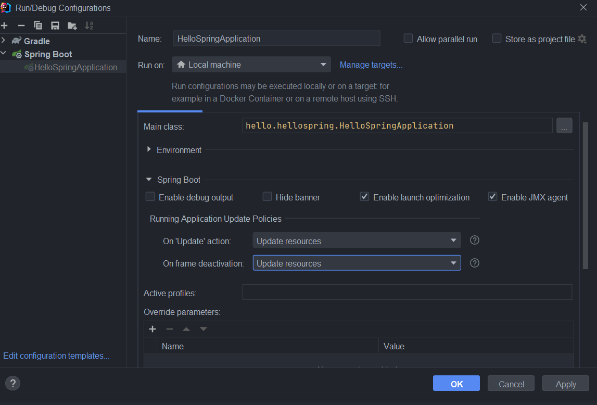

# SpringBoot 프로젝트 생성 및 기본 설정 by IntelliJ

## 프로젝트 생성

#### 1. [링크](https://start.spring.io/)에서 스프링 부트 프로젝트를 생성합니다.


https://start.spring.io/


#### 2. intelliJ에서 new project -> spring initializr로 생성합니다.



#### 1번 선택

Create 버튼 클릭으로 받은 파일의 압축을 푼 후 intelliJ에서 open으로 해당 프로젝트를 불러오면 됩니다.

#### 2번 선택


defendencies 설정을 추가적으로 해 주시면 됩니다.

### 실행시키기

#### application 실행

src -> main -> java -> 패키지 -> <name>SpringApplication

SpringApplication을 실행 시켜 봅니다.(이름은 다를 수 있습니다.)




#### 하단의 console 창 확인

embedded(내장)되어있는 tomcat이 8080포트로 실행이 되는지 확인해 봅니다.



실행 시 화이트스페이스 에러가 뜨면 잘 연결되었다는 뜻입니다.


### 간단한 Hello 출력하기

#### 1. index.html 파일 생성

```
<!DOCTYPE HTML>
<html>
<head>
    <title>Hello</title>
    <meta http-equiv="Content-Type" content="text/html; charset=UTF-8" />
</head>
<body>
Hello
<a href="/hello">hello</a>
</body>
</html>
```

저장 후 서버를 재시작하면


아래 이미지와 같이 페이지가 뜨는것을 알 수 있습니다.


## spring-boot-devtools 설치

#### 1. Gradle(or maven)에 defendency를 추가합니다.

```
dependencies {
	implementation 'org.springframework.boot:spring-boot-starter-thymeleaf'
	implementation 'org.springframework.boot:spring-boot-starter-web'
	providedRuntime 'org.springframework.boot:spring-boot-starter-tomcat'
	testImplementation 'org.springframework.boot:spring-boot-starter-test'
	developmentOnly("org.springframework.boot:spring-boot-devtools")
}
```


#### 2. application이 실행 중이더라도 자동 빌드(컴파일)이 되도록 허락합니다.



#### 3. 자동 빌드(compile)를 허락합니다.



#### 4. intelliJ 우측 상단에서 Edit Configurations를 클릭합니다.



#### 5. 중간 쯤에 On 'update' action과 On frame deactivation을 *update resources* 로 변경합니다.




### References

https://velog.io/@bread_dd/Spring-Boot-Devtools

https://www.inflearn.com/course/%EC%8A%A4%ED%94%84%EB%A7%81-%EC%9E%85%EB%AC%B8-%EC%8A%A4%ED%94%84%EB%A7%81%EB%B6%80%ED%8A%B8/lecture/49573?tab=curriculum
