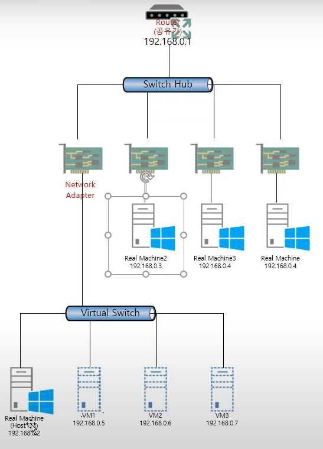

# Hyper-V switch란 무엇일까

아래 링크의 블로그를 참고해서 작성했습니다. 문제 시 글을 내리도록 하겠습니다.

https://blog.limcm.kr/241

### Switch Hub()

- 포트의 번호를 분배해 주는 역할

### Virtual Switch

- 가상환경에서 포트의 번호를 분배해 주는 역할(hostOS와 동일한 수평적 관계를 구성.)

### 가상 스위치 연결 형식

- External

    network adaptor를 이용해서 네트워크를 구성.

- Internal

    hostOS와 guestOS통신 vmOS와 통신

- Private

    vm 끼리 통신할 때 사용

References

---

https://docs.microsoft.com/en-us/windows-server/virtualization/hyper-v/get-started/create-a-virtual-switch-for-hyper-v-virtual-machines

