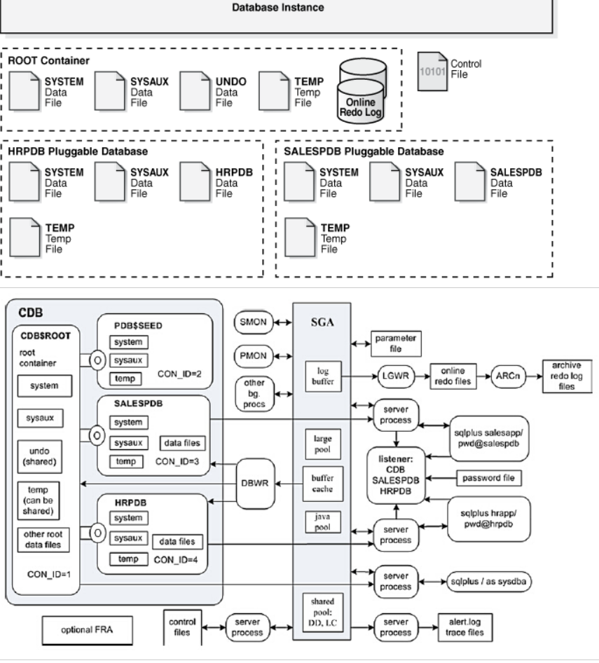
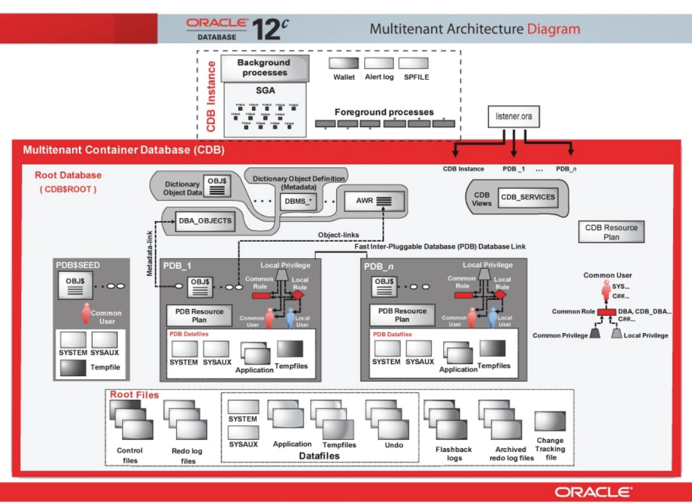

# Oracle의 cdb와 pdb란?

### CDB

Container database

### PDB

Pluggable database

하나의 cdb에는 여러개의 pdb라고 불리는 독립된 데이터베이스를 담을 수 있는 기능을 제공한다.

#### CDB

- CDB는 전체 데이터베이스로 메타데이터 및 데이터베이스의 데이터를 저장하는 여러 개의 컨테이너가 포함된다.

#### 루트 컨테이너

- 각 CDB는 하나의 루트 컨테이너를 포함하고 CDB$ROOT라는 이름을 가진다.
- 이는 스키마, 스키마 오브젝트 또는 전체 CDB에 속한 비스키마 오브젝트에 대한 위치를 제공한다.
- PDB를 관리하는데 필요한 메타데이터를 저장한다.

### Root CDB

#### Seed PDB

- cdb는 새로운 pdb를 만드는데 사용되는 pdb$seed라는 pdb를 가지고 있으며 pdb$seed 내에 오브젝트를 추가하거나 변경할 수 없다.

#### PDB

- PDB는 CDB 내에서 고유하고 독립된 데이터베이스 환경을 가진다. 하나의 CDB는 여러 개의 PDB를 가질 수 있다.

### References

http://www.gurubee.net/lecture/3316