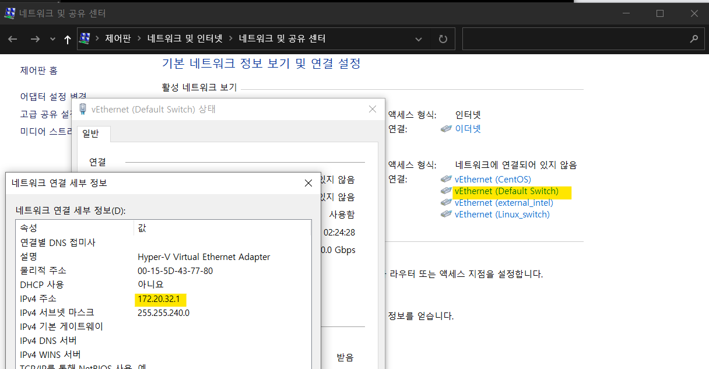

# Hiper-v에서 Linux server(CentOS) 포트포워딩 시키기.


제어판의 네트워크 및 공유 센터로 들어가시면 생성해 놓은 switch 들을 볼 수 있습니다.

생성된 switch들의 IPv4의 주소 가장 끝 자리가 1로 되어 있습니다. 이는 가상 스위치가 스위치 허브의 역할을 한다는 것을 뜻합니다.

[자세한 사항이 궁금하시다면 여기 링크를 참고해주시길 바랍니다.](https://blog.limcm.kr/241?category=627304)



### Centos7 cmd에서 설정하기

```ifconfig``` 명령으로 현재 ip를 확인합니다.

본인이 연결되어 있는 네트워크 인터페이스 이름을 확인합니다.

저는 ```eth0``` 이네요.


### telnet으로 포트 개방여부 확인하기

```
telent [확인한 ip] [포트번호]
```

포트번호는 따로 설정하지 않으셨을 시 22번으로 하시면 됩니다.

만약 연결 응답이 없다는 글이 뜬다면 해당 포트가 닫혀있다는 의미입니다.


### network 설정하기

```
vi /etc/sysconfig/network
```

```
# Created by anaconda
NETWORKING=yes
NETWORKING_IPV6=no
```


### nameserver 추가하기

```
vi /etc/resolv.conf
```

```
#Generated by NetworkManager
nameserver 8.8.8.8
```


 


아래 링크를 참고하시면 더욱 자세한 내용들을 알 수 있습니다.

https://thrillfighter.tistory.com/565

https://blog.limcm.kr/241?category=627304


