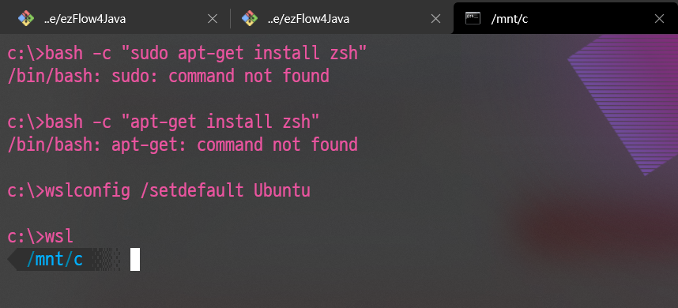

# WindowsTerminal wsl(cmd)를 zsh로 실행시키기 

1. wsl 설치하기

    https://jjam89.tistory.com/125

2. microsoft store-> ubuntu

    https://jjam89.tistory.com/135

3. 명령어 실행하기

    ```
    $ wslconfig /setdefault Ubuntu
    $ wsl
    ```



```list``` 로 현재 wsl을 돌릴 수 있는 환경을 제공합니다.

```
$ wslconfig /list
```


###### *저는 기본으로 docker-desktop으로 되어 있었습니다.* 


# References

https://www.howtogeek.com/344688/how-to-set-your-default-linux-distribution-on-windows-10/